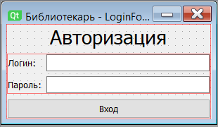
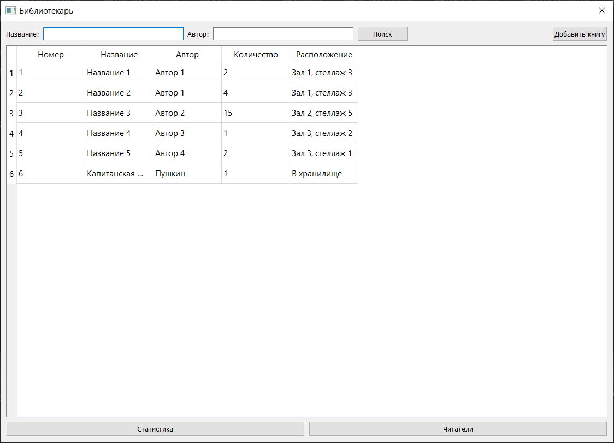
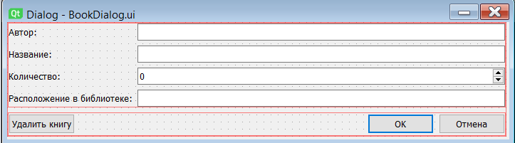
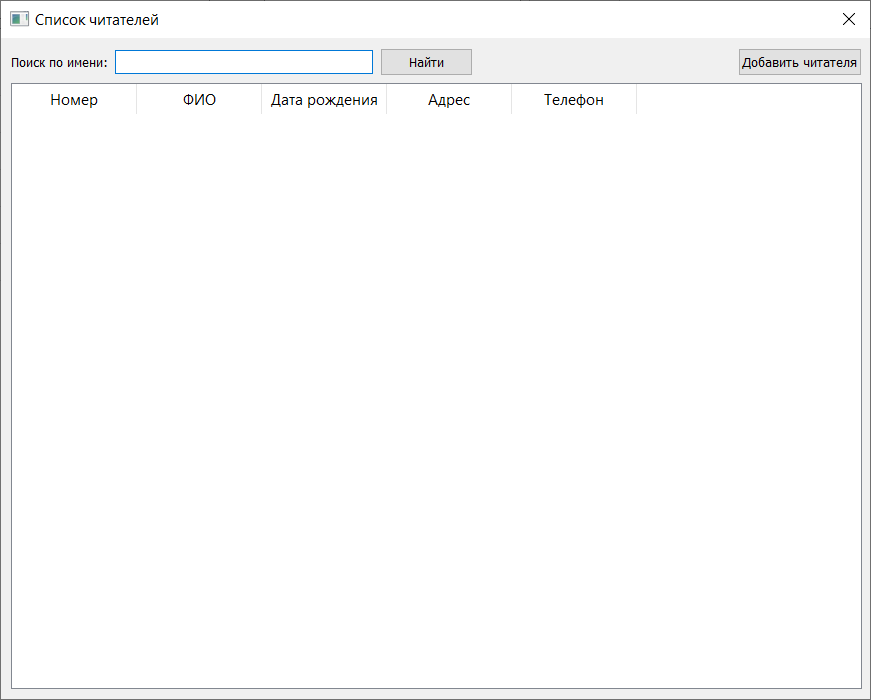
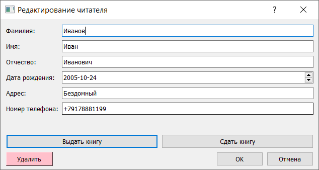
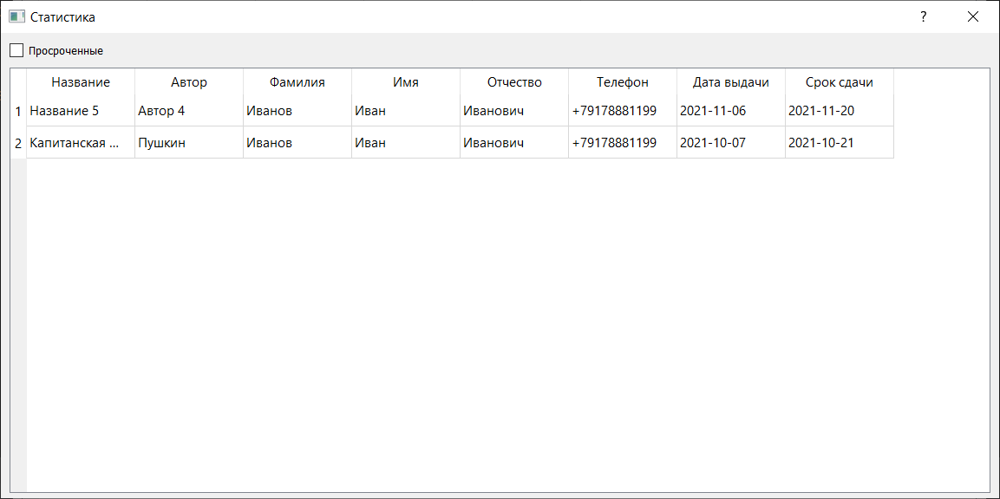

#  Пояснительная записка

##  Анализ проекта

В целях облегчения ручной работы библиотекаря я поставила перед собой задачу написать приложение, которое помогает уменьшить бумажную работу и увеличить эффективность за счёт автоматизации рутинных операций.

##  Цель проекта

Разработать приложение, автоматизирующее ручную работу библиотекаря на языке программирования Python с использованием библиотеки PyQT.

#  Функционал

##  Начальный экран

При входе в приложение пользователю предложено авторизоваться. Если пользователь правильно ввел логин и пароль, то он переходит на основное меню.

##  Основное меню

В основном меню находится список со всеми модулями. Пользователь нажимает на нужный модуль, далее открывается новое окно, соответствующее выбранному модулю. Ниже представлены модули:
1. Список книг
2. Карточки читателей
3. Статистика
4. 

##  Список книг

В верхней части формы элементы управления:
* Поиск по автору или названию
* Добавление новой книги в список

В нижней (основной) части формы расположен список книг в табличном виде. Изначально выводится весь список. В случае ввода критериев поиска список отображает только нужные.

По двойному нажатию на строку списка либо на кнопку добавления можно перейти на форму редактирования книги, где можно:
* Ввести/исправить данные о книге:
  * Автор
  * Название
  * Количество экземпляров
  * Расположение в библиотеке
* Удалить книгу в случае списания
* 

##  Карточки читателей

В верхней части формы есть элементы управления:
* Поиск по имени
* Добавление нового читателя

В нижней (основной) части формы расположен список читателей в табличном виде.
Изначально выводится весь список. В случае ввода критериев поиска список отображает только нужные.

По нажатию на строку списка либо на кнопку добавления можно перейти на форму карточки читателя, где можно:
* Ввести/исправить данные о читателе:
  * ФИО
  * Дата рождения
  * Адрес
  * Телефон
* Выдать книгу
  * Открывается форма аналогичная списку книг, но без функционала редактирования
  * Выбрав книгу, создаётся запись о выдаче со сроком сдачи 2 недели
* Сдать книгу
  * Открывается форма выданных книг (те, у которых нет даты сдачи)
  * Выбрав книгу, запись о выданной книге обновляется датой сдачи

##  Статистика

В верхней части формы находится чекбокс, который фильтрует список книг по статусу (просроченные или все).
В нижней (основой) части формы находится список в виде таблицы с отображением контактных данных читателя.
Изначально чекбокс выключен и отображаются все выданные книги. Если чекбокс включен, список отображает только просроченные книги.
