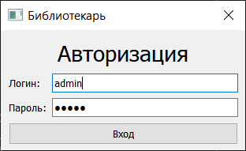
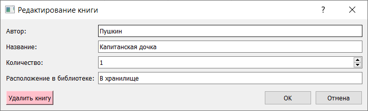
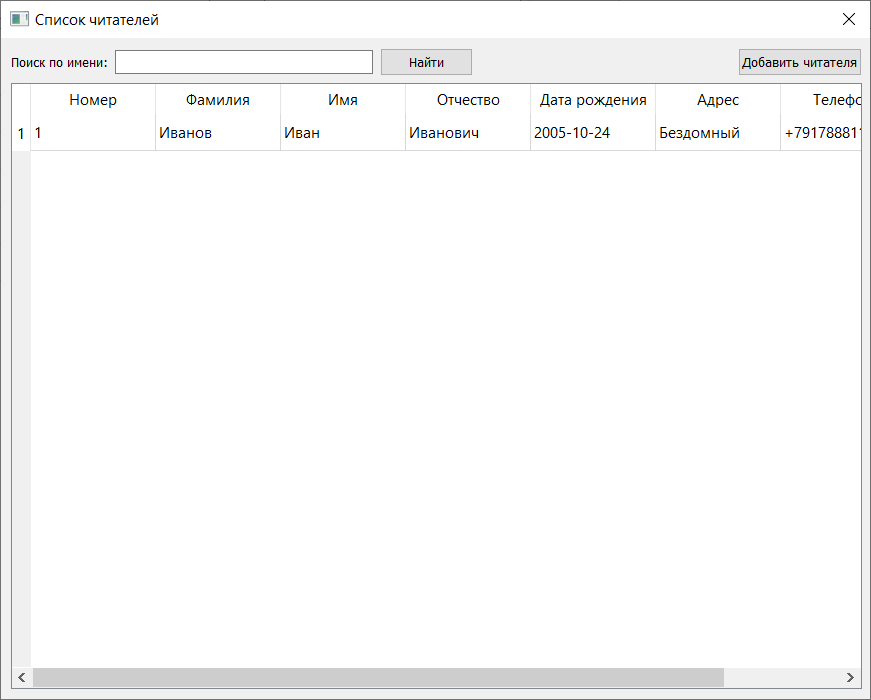

#  Пояснительная записка

##  Анализ проекта

В целях облегчения ручной работы библиотекаря я написала приложение, которое помогает уменьшить бумажную работу и увеличить эффективность за счёт автоматизации рутинных операций.

##  Реализация цели

Разработано приложение, автоматизирующее ручную работу библиотекаря на языке программирования Python с использованием библиотеки PyQT.

#  Функционал

##  Начальный экран

При входе в приложение пользователю предложено авторизоваться. Если пользователь правильно ввел логин и пароль, то он переходит в главную форму со списком книг.

##  Список книг

Элементы управления в верхней части формы:
* Поиск по автору или названию
* Добавление новой книги в список

В средней части формы расположен список книг в табличном виде. Изначально выводится весь список. В случае ввода критериев поиска список отображает только нужные.

Элементы управления в верхней части формы:
* Кнопка для перехода к форме статистики
* Кнопка для перехода к списку читателей

По двойному нажатию на строку списка либо на кнопку добавления можно перейти на форму редактирования книги, где можно:
* Ввести/исправить данные о книге:
  * Автор
  * Название
  * Количество экземпляров
  * Расположение в библиотеке
* Удалить книгу в случае списания

Для создания книги вызывается эта же форма, но кнопка удаления недоступна.

##  Карточки читателей

В верхней части формы есть элементы управления:
* Поиск по имени
* Добавление нового читателя

В средней части формы расположен список читателей в табличном виде.
Изначально выводится весь список. В случае ввода критериев поиска список отображает только нужные.

По нажатию на строку списка либо на кнопку добавления можно перейти на форму карточки читателя, где можно:
* Ввести/исправить данные о читателе:
  * ФИО
  * Дата рождения
  * Адрес
  * Телефон
* Выдать книгу
  * Открывается форма аналогичная списку книг, но без функционала редактирования
  * Выбрав книгу, создаётся запись о выдаче со сроком сдачи 2 недели
* Сдать книгу
  * Открывается форма выданных книг (те, у которых нет даты сдачи)
  * Выбрав книгу, запись о выданной книге обновляется датой сдачи

Для создания читателя вызывается эта же форма, но кнопка удаления недоступна.

## Выдать книгу

Открывается форма со списком книг, которые еще не были выданы на руки.

По двойному щелчку книга выдается читателю.

## Сдать книгу

Открывается форма со списком выданных книг данному читателю.

По двойному щелчку книга сдается в библиотеку.

##  Статистика

В верхней части формы находится чекбокс, который фильтрует список книг по статусу (просроченные или все).
В нижней (основой) части формы находится список в виде таблицы с отображением контактных данных читателя.
Изначально чекбокс выключен и отображаются все выданные книги. Если чекбокс включен, список отображает только просроченные книги.

# Структура базы данных

## Таблица users

Хранит учетные записи библиотекарей.

* Id - уникальный идентификатор записи. Integer.
* login - имя пользователя. Text.
* password - пароль пользователя. Text.

## Таблица books

Хранит информацию о книгах в библиотеке.

* Id - уникальный идентификатор книги. Integer.
* Title - название книги. Text.
* Author - автор книги. Text.
* Count - количество экземпляров. Integer.
* Place - расположение в библиотеке. Text.

## Таблица readers

Хранит информацию о читателях.

* Id - уникальный идентификатор читателя. Integer.
* Surname - фамилия читателя. Text.
* Name - имя читателя. Text.
* PatronymicName - отчество читателя. Text.
* BirthDate - дата рождения читателя. Date.
* HomeAddress - адрес читателя. Text.
* PhoneNumber - номер телефона читателя. Text.

## Таблица given_books

Реестр выданных книг.

* Id - уникальный идентификатор записи в реестре. Integer.
* BookId - идентификатор выданной книги. Integer.
* ReaderId - идентификатор читателя, которому выдали книгу. Integer.
* GivenDate - дата выдачи книги. Date.
* ExpirationDate - срок сдачи книги. Date.
* ReturnDate - дата фактической сдачи, заполняется при сдаче книги. Date.
